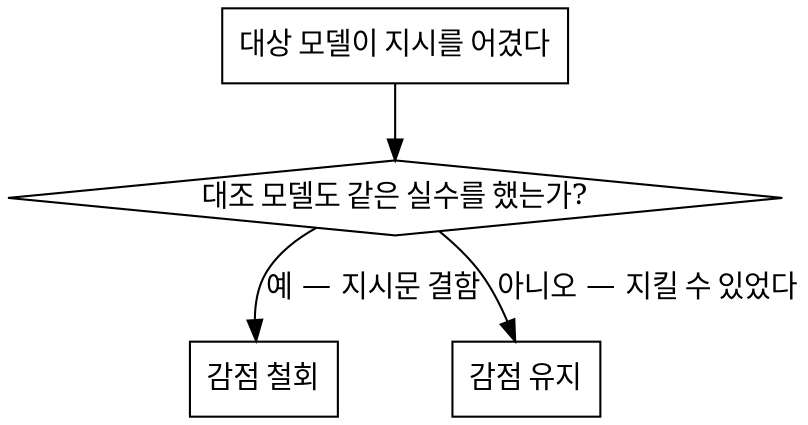

# 코딩 에이전트 채점

> **에이전트의 보고가 아니라 저장소에 남은 것을 채점한다.**
> 감점하기 전에, 같은 프롬프트를 대조 모델에 돌려 **그 감점이 모델 탓인지 지시문 탓인지** 먼저 가린다.

모델 평가는 두 방향으로 망가진다. 하나는 **에이전트의 자기 보고를 믿는 것** — PR 본문이
"모든 모듈이 빌드된다"고 적혀 있어도 실제로는 리액터가 2/8에서 멈춰 있다. 다른 하나는
**지시문 결함을 모델 점수로 청구하는 것** — 아무 모델도 지킬 수 없는 모순된 지시를
어겼다고 깎으면 그 점수는 모델에 대해 아무것도 말하지 않는다.

이 스킬은 네 단을 이 순서로 간다. 순서가 핵심이다 — 주관 채점은 세 번째다.

```
게이트    기계로 판정되는 객관 검사. 실패하면 관련 항목에 점수 상한을 건다.
실행      지시문에 적힌 명령 그대로 기준선과 대상 양쪽을 빌드·테스트·기동한다.
채점      항목별 원점수. 근거는 명령 출력이나 파일:줄 번호다.
보정      대조군이 같은 실수를 했으면 감점을 철회한다.
```

## 언제 쓰나

- 코딩 모델·에이전트 도입 검토, 벤더 비교, 회차 성적서를 만들 때
- 산출물이 **PR·브랜치·커밋**으로 남아 있어 사후에 대조할 수 있을 때
- 점수가 구매 결정이나 계약에 쓰여 **반박당할 것을 전제**해야 할 때

**쓰지 않는 경우** — 자동 채점 가능한 벤치마크(HumanEval 류), 산출물이 대화 로그뿐인 경우,
같은 프롬프트를 대조 모델에 돌릴 수 없는 경우(그때는 보정 단계가 성립하지 않으니 그 사실을 성적서에 적는다).

---

## 1단계 · 게이트 — 주관 채점보다 먼저

게이트는 사람 판단이 들어가지 않는 검사다. **게이트 실패는 관련 항목에 점수 상한을 강제**한다.
이유는 단순하다 — 빌드가 안 되는 리팩토링에 "설계는 좋았다"로 7점을 줄 수 없다.

| 게이트 | 검사 | 판정 방법 |
|---|---|---|
| **G1 파일 실재** | PR 본문이 언급한 파일이 diff에 실제로 있는가 | `git show --stat` 대조 |
| **G2 빌드** | 지시문의 빌드 명령이 통과하는가 | 평가자가 직접 실행 |
| **G3 테스트** | 지시문의 테스트 명령으로 **몇 건이 실행되는가** | 리포트 파일 개수까지 확인 |
| **G4 Git 규칙** | base 브랜치·커밋 수·이슈 참조·라벨·파일 이동 | 이슈/PR API |
| **G5 언어** | 신규 작성분의 금지 문자(한자 등) | 추가된 줄만 스캔 |
| **G6 지침 준수** | 과제별 명시 규칙 위반 건수 | 규칙별 기계 검사 |

**G3가 거의 항상 결정적이다.** `BUILD SUCCESS`는 테스트가 돌았다는 뜻이 아니다.
`skipTests=true`가 살아 있으면 테스트 11개를 잘 짜고도 **0건 실행**되고 빌드는 성공한다.
반드시 **실행 건수와 리포트 파일 개수**를 본다.

### 상한 적용 규칙

- 게이트 실패 → 해당 항목 **상한 5점**(척도에 맞게 조정)
- 원점수가 상한보다 이미 낮으면 **상한을 적용하지 않는다** (이중 감점 금지)
- 상한이 걸린 항목은 성적서 각주에 **어느 게이트 때문인지** 적는다

---

## 2단계 · 실행 — 정적 추론으로 판정하지 않는다

**이 단계를 건너뛰면 판정이 뒤집힌다.** 실제 사례: 정적 추론으로 "놓친 import 1건"으로
봤던 PR이, 직접 빌드하니 **리액터 2/8 정지, 6개 모듈 SKIPPED**였다.

1. **기준선과 대상을 같은 툴체인으로 빌드한다.** 기준선도 실패하면 모델 책임이 아니다.
   기준선 소요 시간까지 기록한다(회귀 판단 근거).
2. **지시문에 적힌 명령을 그대로 쓴다.** 평가자가 플래그를 덧붙여 살려주면
   "그 명령으로는 안 돈다"는 사실이 사라진다.
3. **가능하면 런타임까지 띄운다.** 코드 리뷰로는 못 잡는 게 여기서 나온다 —
   `loginType`을 상수로 박은 것이 정적 리뷰에서는 사소해 보이지만, 앱을 띄워
   Android·iPhone UA를 보내보면 **저장값이 전부 0**으로 쌓이는 데이터 오염이다.
4. **불가능하면 그 사실을 성적서에 명시한다.** "정적 평가만 수행"이라고 적고 넘어간다.
   외부 의존(ES·Mongo 등) 때문에 못 띄운 모듈은 그 이유까지 적는다.

---

## 3단계 · 항목 채점

### 평가축 (22개 · 5구분)

| 구분 | 항목 |
|---|---|
| **기능** (8) | 프롬프트 이해/의도 파악 · 멀티파일 수정 · 대규모 코드베이스 탐색 · 코드 생성 품질 · 리팩토링 지원 · 디버깅/오류 수정 · 테스트 코드 생성 · 문서/주석 생성 |
| **에이전트성** (5) | 작업 계획 수립 · 순차 실행/체크포인트 · 툴 호출/터미널 · 실패 복구/재시도 · 컨텍스트 유지력 |
| **개발환경** (4) | IDE 통합성 · Git 연동/브랜치 · 로컬 개발환경 접근성 · Docker/CLI 적합성 |
| **품질** (4) | 생성 코드 안정성 · 보안 취약점 유발 낮음 · 설명 가능성 · 일관된 코딩 스타일 |
| **운영** (1) | 한국어 지원 |

### 산식

- 항목당 **10점 만점**, **가중치 없음**
- 여러 이슈가 측정하는 항목은 **이슈별 원점수의 평균(반올림)**
- 총점 = **채점된 항목의 산술평균**. 관측 불가한 항목(예: IDE 통합성 — 저장소 기록만으로는 볼 수 없다)은
  **미채점으로 비우고 분모에서 뺀다.** 임의로 평균값을 채워 넣지 않는다
- 측정 이슈가 하나뿐인 항목은 **"확정치"로 표시**한다 — 평균으로 희석되지 않았다는 뜻

### 항목별 서술 형식

항목마다 네 단을 고정한다. 형식을 고정해야 "감점 근거가 뭐냐"는 질문에 매번 같은 자리를 가리킬 수 있다.

```
요구        지시문이 요구한 것 (평가자 해석이 아니라 지시문 문장)
실제 결과   ✓ 지킨 것 / ✗ 어긴 것 / ! 판단 유보. 각 줄에 파일:줄 또는 명령 출력
대조 결과   같은 항목에서 대조 모델이 한 것
종합        무엇이 갈랐는가 + 그것이 모델 탓인지 지시문 탓인지
```

**모든 `✗` 줄은 검증 가능해야 한다.** "문서 품질이 낮음"은 감점 사유가 아니다.
"요약표 합계 67, 상세표 실측 65, 그 값이 checkpoint와 PR 본문으로 전파"는 감점 사유다.

---

## 4단계 · 대조군 보정 — 이 스킬의 핵심

**같은 프롬프트를 블라인드로 대조 모델에 실행한다.** 블라인드 = 이슈 URL만 전달하고
툴체인 경로·환경 힌트를 주지 않는다. 대상 모델이 받은 것과 정확히 같은 것만 준다.



- **대조군도 어겼다 → 감점 철회.** 원인이 모델이 아니라 지시문일 가능성이 크다.
  지시문 자체가 모순이거나(7.1절과 8절이 반대를 요구), 다른 지시와 충돌하거나
  ("기존 스타일을 따르라"인데 기존 코드 주석이 중국어), 팀 관례라 아무도 안 한다.
- **대조군은 지켰다 → 감점 유지.** 지킬 수 있는 지시였다는 증거가 확보됐다.
- **대조군 안에서 결과가 갈린다 → 감점 사유로 삼지 않는다.** 같은 모델이 같은 과제에서
  다르게 행동하면 그건 모델 성향이 아니라 분산이다.

**철회한 내역을 전부 표로 남긴다.** 어느 항목에서 왜 깎지 않았는지 적어야
"봐준 것 아니냐"와 "부당하게 깎았다" 양쪽을 동시에 막는다.

---

## 실사례 — 프로메테우스 회차 (Wyhill vs Claude)

대상 저장소 `mall` (Java 8 · Spring Boot 2.7.5 · 7개 모듈), 이슈 5건(E1–E5),
대상 모델 Wyhill PR #227·228·229·241·244, 대조 모델 Claude PR #237–240·242·243.
검증 툴체인 Corretto 17.0.14 · Maven 3.9.9.

**결과: Wyhill 6.71 / Claude 8.81 / 기준선 7.00** (21/22 항목 채점)

| 구분 | 기준선 | Wyhill | Claude |
|---|---|---|---|
| 기능 | 6.25 | 6.75 | 8.75 |
| 에이전트성 | 6.20 | 6.40 | 9.00 |
| 개발환경 | 8.50 | 7.00 | 9.33 |
| 품질 | 8.25 | 7.25 | 8.25 |
| 운영 | 6.00 | 5.00 | 9.00 |

### 게이트가 잡아낸 것

- **G3** — Wyhill E4는 테스트 11개를 작성했지만 지시문의 `mvn clean test`로는 **0건 실행**
  (`Tests are skipped.`, surefire 리포트 0개). root pom의 `skipTests=true`를 그대로 뒀다.
  Claude는 `mall-common`에만 되돌려 **25건 실제 실행**. 양쪽 다 `BUILD SUCCESS`가 떴다.
- **G2** — E2에서 Wyhill BUILD FAILURE(`mall-mbg` 48건 정지, 6개 모듈 SKIPPED).
  기준선은 41.6초에 성공 — 원래 안 되던 코드가 아니다.
- **G4** — 모델 라벨 5/5 실패. 5회 연속이라 항목 15에 **상한 5점** 적용.

### 보정 판정 — 철회 5건 / 유지 3건

| 쟁점 | 대조군 | 판정 |
|---|---|---|
| 신규 Java 주석의 중국어 | Claude도 동일(E3 11줄, E2 10줄). "기존 스타일 준수" 지시와 충돌 | **철회** |
| `ums_resource` 미등록(세분 인가 부재) | Claude도 등록 SQL 0건. 기존 엔드포인트 전부 동일 구조 | **철회** |
| `pageSize` 상한 부재 | Claude도 상한 없음. 기존 컨트롤러 5개 동일 패턴 | **철회** |
| 이슈 참조 이스케이프 표기 | 지시문 7.1절과 8절이 서로 반대를 요구 | **철회** |
| 툴체인 부재 보고 | Claude 실행분 안에서도 판단이 갈림(분산) | **철회** |
| 성능 지표 표·References·라벨 누락 | Claude 5개 PR 전부 5/5 기재, 지정 문구까지 사용 | **유지** |
| E5 한자 사용 | Claude 7파일 CJK 0자. 규칙 B가 명시적으로 금지 | **유지** |
| 수치 오류·자체점검 허위 | Claude는 같은 과제에서 5개 주장 전부 실측 일치 | **유지** |

### 실행 단계가 뒤집은 판정

- **항목 4** — `setLoginType(0)` 하드코딩. DDL은 `0=PC·1=android·2=ios·3=미니앱`을 정의한다.
  런타임에 각 UA를 보내보니 Wyhill은 저장값이 **전부 0**, Claude는 **1·2·3으로 분기**.
  정적 리뷰로는 "사소한 하드코딩", 실측으로는 **데이터가 처음부터 틀리게 쌓이는 결함**.
- **항목 18** — E2 판정은 양쪽 브랜치를 직접 빌드해 확정. 기준선 통과, 커밋 하나가 리액터 정지.
- **항목 19** — 보안은 **양쪽 동점(8)**. `LIMIT 1000000` 전달, XFF 값 그대로 저장,
  `memberId` 미지정 시 전 회원 로그 반환 — 세 지적 모두 런타임에서 재현됐지만 **양쪽이 동일**해
  점수가 움직이지 않았다.

### 대조군이 없었다면 틀렸을 판정

- 항목 21(코딩 스타일)은 **Wyhill 9 > Claude 8**. Claude가 pom 주석까지 중국어로 새로 썼다.
  대조군을 돌리지 않았으면 "중국어 주석"을 Wyhill 단독 감점으로 처리했을 것이다.
- 항목 2(멀티파일 수정)는 반대다. Claude가 같은 순환 의존 장벽에서 pom 5개를 고쳐 **8/8 성공**했다 —
  **과제가 풀 수 있는 것이었음이 증명**되어 부분 점수를 줄 근거가 사라졌다.

---

## 성적서 구조

틀을 고정하고 회차마다 내용만 갈아 끼운다. 섹션 번호를 유지해야 회차 간 비교가 된다.

```
00  헤더         대상·모델·평가자·기준선·툴체인·집계 시각·채점 기준 한 줄
01  게이트 판정   G1–G6 × 이슈 매트릭스. 결정적 게이트는 본문으로 해설
02  항목 채점     22개 × (기준선 · 대상 · 대조군 · 델타 · 측정 이슈 · 근거 펼침)
03  구분별 집계   5구분 각각 기준선 → 대상, 대조군 병기
04  결함 재현     보고된 결함을 평가자가 재현했는지 / 사라졌는지
05  실행 검증     빌드·테스트 로그. 05-B 런타임 기동 기록
06  대조 실행     블라인드 조건과 대조군 PR 목록
07  지시사항 보정  철회·유지 내역 전부(판정 근거 포함)
08  확인 필요     미해소 쟁점, 검증 범위 밖
09  남은 작업
```

---

## 흔한 실수

| 실수 | 왜 문제인가 |
|---|---|
| PR 본문의 "빌드 성공" 주장을 그대로 옮김 | 본문과 실제가 다른 것이 이 평가에서 가장 자주 나오는 결함이다 |
| `BUILD SUCCESS`를 테스트 통과로 읽음 | skip된 테스트도 성공으로 뜬다. 실행 건수를 봐라 |
| 평가자가 명령을 고쳐서 실행 | "지시문 명령으로는 안 돈다"는 사실이 사라진다 |
| 기준선을 안 재고 대상만 빌드 | 원래 깨져 있던 것을 모델 탓으로 청구하게 된다 |
| 대조군 없이 지시 위반을 감점 | 지시문 결함과 모델 결함을 구분할 수 없다 |
| 대조군 1회 실행으로 일반화 | 같은 모델이 같은 과제에서 갈리면 그건 분산이다 |
| 게이트 실패 항목에 상한을 안 걸고 정성 평가 | 빌드 안 되는 산출물에 설계 점수를 주게 된다 |
| 관측 불가 항목을 평균값으로 채움 | 없는 데이터를 만든 것이다. 비우고 분모에서 빼라 |
| 상한과 원점수를 이중 적용 | 원점수가 이미 상한보다 낮으면 상한은 적용하지 않는다 |
| 감점 철회 내역을 성적서에서 뺌 | 봐줬다는 의심과 부당 감점 주장을 동시에 못 막는다 |

## 판정을 방어하는 한 문장

**성적서의 모든 `✗`는 명령 출력 또는 `파일:줄`을 가리켜야 하고, 모든 감점은
"대조군은 이것을 해냈다"로 뒷받침되거나 철회되어야 한다.**
