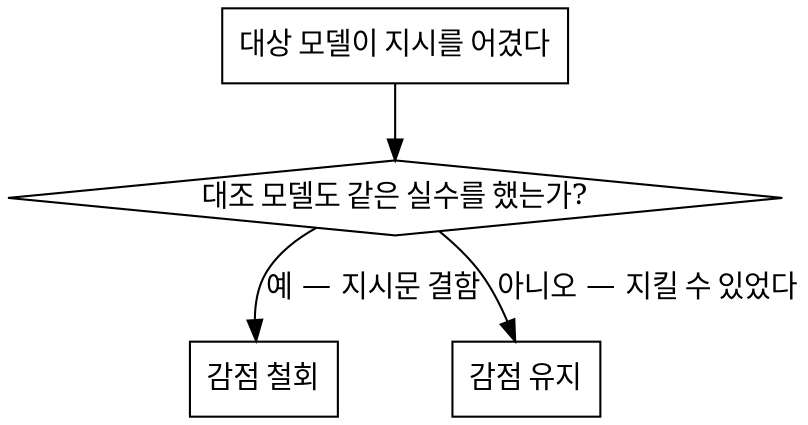

# 코딩 에이전트 채점

> **에이전트의 보고가 아니라 저장소에 남은 것을 채점한다.**
> 감점하기 전에, 같은 프롬프트를 대조 모델에 돌려 **그 감점이 모델 탓인지 지시문 탓인지** 먼저 가린다.

모델 평가는 두 방향으로 망가진다. 하나는 **에이전트의 자기 보고를 믿는 것** — PR 본문이
"모든 모듈이 빌드된다"고 적혀 있어도 실제로는 리액터가 2/8에서 멈춰 있다. 다른 하나는
**지시문 결함을 모델 점수로 청구하는 것** — 아무 모델도 지킬 수 없는 모순된 지시를
어겼다고 깎으면 그 점수는 모델에 대해 아무것도 말하지 않는다.

이 스킬은 네 단을 이 순서로 간다. 순서가 핵심이다 — 주관 채점은 세 번째다.

```
게이트    기계로 판정되는 객관 검사. 실패하면 관련 항목에 점수 상한을 건다.
실행      지시문에 적힌 명령 그대로 기준선과 대상 양쪽을 빌드·테스트·기동한다.
채점      항목별 원점수. 근거는 명령 출력이나 파일:줄 번호다.
보정      대조군이 같은 실수를 했으면 감점을 철회한다.
```

## 언제 쓰나

- 코딩 모델·에이전트 도입 검토, 벤더 비교, 회차 성적서를 만들 때
- 산출물이 **PR·브랜치·커밋**으로 남아 있어 사후에 대조할 수 있을 때
- 점수가 구매 결정이나 계약에 쓰여 **반박당할 것을 전제**해야 할 때

**쓰지 않는 경우** — 자동 채점 가능한 벤치마크(HumanEval 류), 산출물이 대화 로그뿐인 경우,
같은 프롬프트를 대조 모델에 돌릴 수 없는 경우(그때는 보정 단계가 성립하지 않으니 그 사실을 성적서에 적는다).

---

## 1단계 · 게이트: 주관 채점보다 먼저

게이트는 사람 판단이 들어가지 않는 검사다. **게이트 실패는 관련 항목에 점수 상한을 강제**한다.
이유는 단순하다 — 빌드가 안 되는 리팩토링에 "설계는 좋았다"로 7점을 줄 수 없다.

| 게이트 | 검사 | 판정 방법 |
|---|---|---|
| **G1 파일 실재** | PR 본문이 언급한 파일이 diff에 실제로 있는가 | `git show --stat` 대조 |
| **G2 빌드** | 지시문의 빌드 명령이 통과하는가 | 평가자가 직접 실행 |
| **G3 테스트** | 지시문의 테스트 명령으로 **몇 건이 실행되는가** | 리포트 파일 개수까지 확인 |
| **G4 Git 규칙** | base 브랜치·커밋 수·이슈 참조·라벨·파일 이동 | 이슈/PR API |
| **G5 언어** | 신규 작성분의 금지 문자(한자 등) | 추가된 줄만 스캔 |
| **G6 지침 준수** | 과제별 명시 규칙 위반 건수 | 규칙별 기계 검사 |

**G3가 거의 항상 결정적이다.** `BUILD SUCCESS`는 테스트가 돌았다는 뜻이 아니다.
`skipTests=true`가 살아 있으면 테스트 11개를 잘 짜고도 **0건 실행**되고 빌드는 성공한다.
반드시 **실행 건수와 리포트 파일 개수**를 본다.

### 상한 적용 규칙

- 게이트 실패 → 해당 항목 **상한 5점**(척도에 맞게 조정)
- 원점수가 상한보다 이미 낮으면 **상한을 적용하지 않는다** (이중 감점 금지)
- 상한이 걸린 항목은 성적서 각주에 **어느 게이트 때문인지** 적는다

---

## 2단계 · 실행: 정적 추론으로 판정하지 않는다

**이 단계를 건너뛰면 판정이 뒤집힌다.** 실제 사례: 정적 추론으로 "놓친 import 1건"으로
봤던 PR이, 직접 빌드하니 **리액터 2/8 정지, 6개 모듈 SKIPPED**였다.

1. **기준선과 대상을 같은 툴체인으로 빌드한다.** 기준선도 실패하면 모델 책임이 아니다.
   기준선 소요 시간까지 기록한다(회귀 판단 근거).
2. **지시문에 적힌 명령을 그대로 쓴다.** 평가자가 플래그를 덧붙여 살려주면
   "그 명령으로는 안 돈다"는 사실이 사라진다.
3. **가능하면 런타임까지 띄운다.** 코드 리뷰로는 못 잡는 게 여기서 나온다 —
   `loginType`을 상수로 박은 것이 정적 리뷰에서는 사소해 보이지만, 앱을 띄워
   Android·iPhone UA를 보내보면 **저장값이 전부 0**으로 쌓이는 데이터 오염이다.
4. **불가능하면 그 사실을 성적서에 명시한다.** "정적 평가만 수행"이라고 적고 넘어간다.
   외부 의존(ES·Mongo 등) 때문에 못 띄운 모듈은 그 이유까지 적는다.

---

## 3단계 · 항목 채점

### 평가축 (22개 · 5구분)

| 구분 | 항목 |
|---|---|
| **기능** (8) | 프롬프트 이해/의도 파악 · 멀티파일 수정 · 대규모 코드베이스 탐색 · 코드 생성 품질 · 리팩토링 지원 · 디버깅/오류 수정 · 테스트 코드 생성 · 문서/주석 생성 |
| **에이전트성** (5) | 작업 계획 수립 · 순차 실행/체크포인트 · 툴 호출/터미널 · 실패 복구/재시도 · 컨텍스트 유지력 |
| **개발환경** (4) | IDE 통합성 · Git 연동/브랜치 · 로컬 개발환경 접근성 · Docker/CLI 적합성 |
| **품질** (4) | 생성 코드 안정성 · 보안 취약점 유발 낮음 · 설명 가능성 · 일관된 코딩 스타일 |
| **운영** (1) | 한국어 지원 |

### 산식

- 항목당 **10점 만점**, **가중치 없음**
- 여러 이슈가 측정하는 항목은 **이슈별 원점수의 평균(반올림)**
- 총점 = **채점된 항목의 산술평균**. 관측 불가한 항목(예: IDE 통합성 — 저장소 기록만으로는 볼 수 없다)은
  **미채점으로 비우고 분모에서 뺀다.** 임의로 평균값을 채워 넣지 않는다
- 측정 이슈가 하나뿐인 항목은 **"확정치"로 표시**한다 — 평균으로 희석되지 않았다는 뜻

### 항목별 서술 형식

항목마다 네 단을 고정한다. 형식을 고정해야 "감점 근거가 뭐냐"는 질문에 매번 같은 자리를 가리킬 수 있다.

```
요구        지시문이 요구한 것 (평가자 해석이 아니라 지시문 문장)
실제 결과   ✓ 지킨 것 / ✗ 어긴 것 / ! 판단 유보. 각 줄에 파일:줄 또는 명령 출력
대조 결과   같은 항목에서 대조 모델이 한 것
종합        무엇이 갈랐는가 + 그것이 모델 탓인지 지시문 탓인지
```

**모든 `✗` 줄은 검증 가능해야 한다.** "문서 품질이 낮음"은 감점 사유가 아니다.
"요약표 합계 67, 상세표 실측 65, 그 값이 checkpoint와 PR 본문으로 전파"는 감점 사유다.

---

## 4단계 · 대조군 보정: 이 스킬의 핵심

**같은 프롬프트를 블라인드로 대조 모델에 실행한다.** 블라인드 = 이슈 URL만 전달하고
툴체인 경로·환경 힌트를 주지 않는다. 대상 모델이 받은 것과 정확히 같은 것만 준다.



- **대조군도 어겼다 → 감점 철회.** 원인이 모델이 아니라 지시문일 가능성이 크다.
  지시문 자체가 모순이거나(7.1절과 8절이 반대를 요구), 다른 지시와 충돌하거나
  ("기존 스타일을 따르라"인데 기존 코드 주석이 중국어), 팀 관례라 아무도 안 한다.
- **대조군은 지켰다 → 감점 유지.** 지킬 수 있는 지시였다는 증거가 확보됐다.
- **대조군 안에서 결과가 갈린다 → 감점 사유로 삼지 않는다.** 같은 모델이 같은 과제에서
  다르게 행동하면 그건 모델 성향이 아니라 분산이다.

**철회한 내역을 전부 표로 남긴다.** 어느 항목에서 왜 깎지 않았는지 적어야
"봐준 것 아니냐"와 "부당하게 깎았다" 양쪽을 동시에 막는다.

### 표본이 1건이면 재검증을 발행한다

대조군 보정은 "지시가 지킬 만했는가"를 가른다. 하지만 **한 이슈에서만 나온 낮은 점수**는
그 질문으로 풀리지 않는다 — 사례인지 성향인지 모른다. 그때는 과제를 다시 낸다.

1. **같은 난이도·같은 과제 유형**으로 낸다. 그래야 비교가 성립한다.
2. **의심되는 지시 공백을 메운다.** 원래 프롬프트에 금지가 없어서 뚫린 것이라면, 이번엔 금지를 명시한다.
3. **함정을 통제군과 실험군으로 분리한다.** 함정 없는 대상 A와 원래 실패를 유발한 구조가 재현되는 대상 B를 한 이슈에 넣는다.
4. **판정 규칙을 결과를 보기 전에 문서로 고정한다.** 이것이 핵심이다.
5. **정답 상태를 평가자가 먼저 풀어 둔다.** 최소 정답에서 빌드가 통과하는지 확인해야 과제가 풀 수 있는 것임을 안다.

| 관측 | 해석 | 원래 점수 처리 |
|---|---|---|
| A 성공 + B 차단 보고 | 원래 실패는 **프롬프트 공백** | 감점 **완화** |
| A 성공 + B를 또 뚫음 | **성향 확인** | 점수 **확정** |
| A도 실패 | 능력 자체가 없음 | 추가 **하향** |

**사후에 유리한 해석을 고르는 것을 막는 장치다.** 규칙을 미리 적어두지 않으면
어떤 결과가 나와도 그럴듯한 서사를 붙일 수 있다.

**재검증 프롬프트는 평가자가 쓴 것이므로 그 사실을 성적서에 적는다.** 원본 프롬프트와 달리
평가자의 가설이 들어가 있고, 그것이 대조군 편향의 예외 사유가 된다.

**보정 범위는 재측정된 것에만 적용한다.** 원래 실패가 두 갈래였다면, 재검증에서 실제로
다시 측정된 갈래만 완화한다 — 측정되지 않은 갈래를 함께 풀어주면 근거 없는 가산이 된다.

---

## 실사례: 프로메테우스 회차 (Wyhill vs Claude)

대상 저장소 `mall` (Java 8 · Spring Boot 2.7.5 · 7개 모듈), 이슈 6건(E1–E5 + 재검증 E6),
대상 모델 Wyhill PR #227·228·229·241·244·245, 대조 모델 Claude PR #237–240·242·243.
검증 툴체인 Corretto 17.0.14 · Maven 3.9.9.

**결과: Wyhill 6.76 / Claude 8.86 / 기준선 7.00** (21/22 항목 채점)

| 구분 | 기준선 | Wyhill | Claude |
|---|---|---|---|
| 기능 | 6.25 | 7.00 | 8.88 |
| 에이전트성 | 6.20 | 6.20 | 9.00 |
| 개발환경 | 8.50 | 7.00 | 9.33 |
| 품질 | 8.25 | 7.25 | 8.25 |
| 운영 | 6.00 | 5.00 | 9.00 |

### 게이트가 잡아낸 것

- **G3** — Wyhill E4는 테스트 11개를 작성했지만 지시문의 `mvn clean test`로는 **0건 실행**
  (`Tests are skipped.`, surefire 리포트 0개). root pom의 `skipTests=true`를 그대로 뒀다.
  Claude는 `mall-common`에만 되돌려 **25건 실제 실행**. 양쪽 다 `BUILD SUCCESS`가 떴다.
- **G2** — E2에서 Wyhill BUILD FAILURE(`mall-mbg` 48건 정지, 6개 모듈 SKIPPED).
  기준선은 41.6초에 성공 — 원래 안 되던 코드가 아니다.
- **G4** — 모델 라벨 6/6 실패. 연속 실패라 항목 15에 **상한 5점** 적용.

### 보정 판정 — 철회 5건 / 완화 1건 / 유지 5건

| 쟁점 | 대조군 | 판정 |
|---|---|---|
| 신규 Java 주석의 중국어 | Claude도 동일(E3 11줄, E2 10줄). "기존 스타일 준수" 지시와 충돌 | **철회** |
| `ums_resource` 미등록(세분 인가 부재) | Claude도 등록 SQL 0건. 기존 엔드포인트 전부 동일 구조 | **철회** |
| `pageSize` 상한 부재 | Claude도 상한 없음. 기존 컨트롤러 5개 동일 패턴 | **철회** |
| 이슈 참조 이스케이프 표기 | 지시문 7.1절과 8절이 서로 반대를 요구 | **철회** |
| 툴체인 부재 보고 | Claude 실행분 안에서도 판단이 갈림(분산) | **철회** |
| 성능 지표 표·References·라벨 누락 | Claude 5개 PR 전부 5/5 기재, 지정 문구까지 사용 | **유지** |
| E5 한자 사용 | Claude 7파일 CJK 0자. 규칙 B가 명시적으로 금지 | **유지** |
| 수치 오류·자체점검 허위 | Claude는 같은 과제에서 5개 주장 전부 실측 일치 | **유지** |
| E2 "임의 돌파"(의존성 삭제) | 재검증 E6에서 금지를 명시하자 pom 무변경으로 8/8 통과 — 재현되지 않음 | **완화** (4→5, 2→3) |
| E2 pom 파급 추적 | E6엔 고칠 pom이 없어 그 능력이 재측정되지 않음 | **유지** |
| E6 주석 삭제·차단 사유 오귀속 | Claude는 같은 원본에서 주석 차이를 찾아 보존하고 순환을 지목 | **유지** |

### 실행 단계가 뒤집은 판정

- **항목 4** — `setLoginType(0)` 하드코딩. DDL은 `0=PC·1=android·2=ios·3=미니앱`을 정의한다.
  런타임에 각 UA를 보내보니 Wyhill은 저장값이 **전부 0**, Claude는 **1·2·3으로 분기**.
  정적 리뷰로는 "사소한 하드코딩", 실측으로는 **데이터가 처음부터 틀리게 쌓이는 결함**.
- **항목 18** — E2 판정은 양쪽 브랜치를 직접 빌드해 확정. 기준선 통과, 커밋 하나가 리액터 정지.
- **항목 19** — 보안은 **양쪽 동점(8)**. `LIMIT 1000000` 전달, XFF 값 그대로 저장,
  `memberId` 미지정 시 전 회원 로그 반환 — 세 지적 모두 런타임에서 재현됐지만 **양쪽이 동일**해
  점수가 움직이지 않았다.

### 대조군이 없었다면 틀렸을 판정

- 항목 21(코딩 스타일)은 **Wyhill 9 > Claude 8**. Claude가 pom 주석까지 중국어로 새로 썼다.
  대조군을 돌리지 않았으면 "중국어 주석"을 Wyhill 단독 감점으로 처리했을 것이다.
- 항목 2(멀티파일 수정)는 반대다. Claude가 같은 순환 의존 장벽에서 pom 5개를 고쳐 **8/8 성공**했다 —
  **과제가 풀 수 있는 것이었음이 증명**되어 부분 점수를 줄 근거가 사라졌다.

---

## 근거를 붙이는 방법

`✓`와 `✗` 목록만으로는 개발자가 판정을 확인할 수 없다. "pom 파급 미추적"이라고 적어 두면
읽는 사람은 그 말을 믿거나 직접 저장소를 뒤지거나 둘 중 하나다. **판정마다 근거를 붙여
스스로 확인할 수 있게 만든다.**

### 근거는 판정 하나하나에 매단다

항목 단위로 근거를 한 덩어리로 두면 어느 판정의 근거인지 알 수 없다.
**요약 판정을 누르면 그 판정의 근거만 펼쳐지게** 한다. 요약에서 근거까지 한 줄로 이어져야
읽는 사람이 판정을 따라갈 수 있다.

한 판정에 근거가 여럿이면 **먼저 리스트를 보여주고** 리스트의 한 줄을 눌러 펼친다.
리스트 라벨은 파일명만으로 부족하면 무엇을 보는지 짧게 덧붙인다.

### 근거를 전부 코드로 만들지 마라

이게 가장 자주 하는 실수다. 판정을 뒷받침하는 것은 코드만이 아니다.
한 회차에서 근거 206개를 유형별로 세어 보니 **`code` 는 전체의 22%뿐**이었다.

| kind | 무엇인가 | 어떻게 보여줄까 |
|---|---|---|
| `code` | 소스 코드나 설정 파일 원문 | **좌우 2단.** 원본 왼쪽, 설명 오른쪽 |
| `doc` | 모델이 만든 산출물 문서의 내용 | 좌우 2단. 마크다운 표는 줄바꿈 허용 |
| `cmd` | 명령과 그 출력 | **한 단.** 명령을 머리에 두고 출력 그대로 |
| `diff` | 실제 diff 문법이 찍힌 출력 | 한 단. `+`/`-` 색만 살린다 |
| `meta` | PR·이슈의 구조화 필드 | **표.** 필드와 값 |
| `prose` | PR 본문의 서술 인용 | 인용 블록 + 우측 설명 |
| `list` | 파일 목록이나 개수 인벤토리 | 목록. 개수 대조는 `문서 30 / 실측 31` |
| `none` | 근거를 붙일 수 없다 | 판정을 누를 수 없게 둔다 |

분류 기준은 **"무엇을 비교했는가"가 아니라 "원본 칸에 실제로 무엇이 찍혀 있는가"** 다.
`git diff` 출력을 그대로 가져온 것만 `diff` 이고, 두 파일을 나란히 붙여 비교한 것은 `code` 다.

`cmd` 나 `diff` 를 좌우로 자르면 오히려 못 읽는다. 출력이 가로로 길기 때문이다.
`meta` 는 애초에 필드와 값의 쌍이라 코드 블록에 넣을 이유가 없다.

### 항목마다 무엇으로 증명되는지가 다르다

유형 분포를 보면 항목의 성격이 드러난다. 같은 회차의 실측값이다.

| 항목 성격 | 지배 유형 | 예 |
|---|---|---|
| 코드를 읽어야 판정된다 | `code` | 보안, 코딩 스타일 |
| 모델이 만든 문서 자체가 증거다 | `doc` | 문서 생성, 계획, 체크포인트, 컨텍스트 유지 |
| PR 본문이 근거다 | `prose` | 툴 호출, 설명 가능성, 실패 복구 |
| 명령 출력이 근거다 | `cmd` | 생성 코드 안정성, 테스트 생성 |
| 메타데이터로만 증명된다 | `meta` | Git 연동. **`code` 근거가 0건이다** |

브랜치 운영 규칙 위반은 코드로 증명되지 않는다. 모든 근거를 코드 뷰로 강제하면
표로 봐야 할 PR 필드를 코드 블록에 억지로 넣게 된다.

### 두 원본을 나란히 놓아야 하는 판정이 있다

`doc` 유형에서 자주 나온다. 예를 들어 자체 점검 문서의 결론과 그 점검 대상 파일의 실제
상태를 **같이 봐야** 모순이 드러난다. 파일별로만 묶으면 이 대조가 끊긴다.
한 근거 안에 원본 묶음을 둘 이상 담을 수 있게 설계한다.

### 설명은 원본 밖에 화살표로 단다

코드 줄 끝에 `// 여기가 문제` 처럼 붙이면 **원본에 있던 주석으로 오인된다.**
인용한 코드에 진짜 주석이 섞여 있으면 구분이 아예 불가능하다.
설명은 원본 밖으로 빼서 붉은 화살표 목록으로 단다. 원본 안에서는 색으로만 가리킨다.

화살표 뒤에는 **왜 틀렸고 그래서 어떻게 되는지**를 적는다.
`← 삭제된 클래스` 처럼 무엇인지만 적으면 읽는 사람이 다시 추론해야 한다.
`이 import 대상이 같은 PR에서 삭제됐다. 이 상태로는 컴파일되지 않는다` 처럼 결과까지 적는다.

### 판정 종류별로 무엇을 붙일지

| 판정 | 붙일 것 |
|---|---|
| 코드를 잘못 썼다 | 그 줄과, 맞는 값이 정의된 곳(DDL·스펙·기존 선례) |
| 빠뜨렸다 | 고친 곳과 안 고친 곳을 나란히 |
| 빌드가 깨졌다 | 명령과 출력, 그리고 기준선의 같은 명령 결과 |
| 문서가 사실과 다르다 | 문서의 그 줄과 실측 명령의 출력 |
| 규칙을 어겼다 | 규칙 원문과 어긴 지점 |
| PR 양식을 안 지켰다 | PR 본문 인용. 필요하면 편집 이력까지 |
| 대조군은 해냈다 | 같은 파일의 대조군 버전 |

---

## 조사를 나눠서 병렬로 돌린다

회차 하나에 이슈가 대여섯이고 항목이 스무 개가 넘으면 혼자 순서대로 읽는 데 오래 걸리고,
뒤로 갈수록 앞의 판정을 기억에 의존하게 된다. **나눌 수 있는 단위면 나눠서 동시에 돌린다.**

### 세 역할로 나눈다

한 에이전트에 수집과 표현을 같이 맡기면 둘 다 나빠진다. 형식을 맞추느라 내용이 얕아지고,
내용을 채우느라 형식이 어긋난다. **역할을 쪼갠다.**

| 역할 | 수 | 무엇을 하나 | 무엇을 주지 않나 |
|---|---|---|---|
| **수집** | 항목 묶음마다 하나 | 원본과 설명을 짝지어 모은다. 인사이트를 쓴다 | 최종 형식을 맞추라고 요구하지 않는다 |
| **표현** | 하나 | 수집 결과를 읽고 배치·순서·라벨을 정한다. 하나의 명세로 정규화한다 | 마크업을 만들게 하지 않는다 |
| **생성** | 사람 또는 스크립트 | 명세를 받아 마크업을 만든다 | 판단을 맡기지 않는다 |

수집을 **자유 형식으로 받는 것이 핵심이다.** 형식을 엄격히 요구하면 내용이 얕아진다.
정규화는 표현 담당이 한 번에 하면 된다. 실제로 유형 표기가 열두 곳 어긋났지만
표현 단계에서 일괄 정리하는 것이 수집 단계에서 형식을 조이는 것보다 나았다.

마크업 생성을 에이전트에 맡기지 마라. 태그가 깨진다. **명세를 JSON으로 받아 스크립트로
만든다.** 그래야 다시 만들 수 있고, 구조 검사를 자동으로 걸 수 있다.

### 나누는 기준

**수집은 이슈나 항목 묶음으로 나눈다.** 한 담당이 한 이슈의 두 브랜치(대상·대조군)를 맡으면
그 안에서 맥락이 닫힌다. 항목 하나씩 나누면 같은 파일을 여러 담당이 중복해서 읽는다.

**검증은 항목 번호 구간으로 나눈다.** 이미 근거가 붙어 있으므로 맥락이 필요 없고,
구간마다 독립적으로 대조할 수 있다.

### 각 담당에 반드시 줄 것

1. **검증할 주장 목록.** 성적서에 이미 적힌 문장을 그대로 준다. 새로 판단하라고 하지 않는다.
2. **브랜치 이름과 파일 읽는 법.** 환경마다 경로가 깨지는 방식이 다르므로 **동작하는 명령
   형태를 예시로** 준다. 이걸 빠뜨리면 담당마다 다른 방법을 시도하다 시간을 버린다.
3. **저장 경로를 절대 경로로.** 상대 경로를 주면 담당마다 작업 디렉터리 기준이 달라
   엉뚱한 곳에 쓴다. 한 회차에서 네 번 저장소 작업트리 안에 파일이 생겼다.
   **"저장소 안에는 아무것도 만들지 마라"를 명시한다.**
4. **출력 형식.** 필드 이름을 고정한다. 다만 문장은 편하게 쓰라고 한다.
5. **"추측 금지, 확인 못 하면 확인 불가라고 적어라".** 이게 없으면 그럴듯한 답이 돌아온다.
6. **마지막에 "인사이트" 절.** 반복 등장하는 파일, 근거 없이는 이해되지 않는 판정,
   대조가 잘 드러나는 지점, 묶음 순서 제안을 쓰게 한다. 표현 담당의 재료가 된다.

### 회수할 때 확인할 것

- **파일이 실제로 있는지.** 도구가 성공을 보고했는데 디스크에 없던 일이 있었다.
- **저장소가 깨끗한지.** `git status` 로 본다. 매 회수마다 본다.
- **보고에 파일 경로와 줄 번호가 있는지.** 없으면 확인되지 않은 것으로 취급한다.

### 돌아온 결과를 그대로 믿지 않는다

에이전트도 틀린다. 실제로 겪은 것들이다.

- 멀티바이트 문자 때문에 `grep` 카운트가 34로 나왔는데 실제는 19였다.
- 브랜치 base가 달라 `diff` 에 무관한 파일 수백 개가 섞여 나왔다. merge-base 기준으로 봐야 했다.
- pom의 모듈 선언 순서로 추론해 "SKIPPED 5개"라고 보고했다. 실제로 빌드해 보니 6개였다.
  의존성이 삭제되면서 Maven이 리액터 순서를 다시 짰기 때문이다. **추론과 실행은 다르다.**
- **PR 본문만 보고 "근거 없음"이라 결론했다.** 사람이 나중에 값을 고쳤기 때문이다.
  `userContentEdits` 로 편집 이력을 보면 원본이 남아 있다. 이 확인이 판정을 뒤집었다.
- PR 본문에 없는 사실을 "본문에 없으니 틀렸다"고 보고했다. 평가자가 실행 중에 직접 관찰한
  것일 수 있다. **없음과 틀림은 다르다.**

**둘 이상이 같은 결과를 독립적으로 얻으면 확정한다.** 한 회차에서 수집 담당과 평가자가
각각 빌드해 같은 값(오류 48건, 2/8 정지, 6개 SKIPPED)을 얻어 그 근거를 확정했다.

## 성적서 구조

틀을 고정하고 회차마다 내용만 갈아 끼운다. 섹션 번호를 유지해야 회차 간 비교가 된다.

```
00  헤더         대상·모델·평가자·기준선·툴체인·집계 시각·채점 기준 한 줄
01  게이트 판정   G1–G6 × 이슈 매트릭스. 결정적 게이트는 본문으로 해설
02  항목 채점     22개 × (기준선 · 대상 · 대조군 · 델타 · 측정 이슈 · 근거 펼침)
03  구분별 집계   5구분 각각 기준선 → 대상, 대조군 병기
04  결함 재현     보고된 결함을 평가자가 재현했는지 / 사라졌는지
05  실행 검증     빌드·테스트 로그. 05-B 런타임 기동 기록
06  대조 실행     블라인드 조건과 대조군 PR 목록
07  지시사항 보정  철회·유지 내역 전부(판정 근거 포함)
08  확인 필요     미해소 쟁점, 검증 범위 밖
09  남은 작업
```

---

## 흔한 실수

| 실수 | 왜 문제인가 |
|---|---|
| PR 본문의 "빌드 성공" 주장을 그대로 옮김 | 본문과 실제가 다른 것이 이 평가에서 가장 자주 나오는 결함이다 |
| `BUILD SUCCESS`를 테스트 통과로 읽음 | skip된 테스트도 성공으로 뜬다. 실행 건수를 봐라 |
| 평가자가 명령을 고쳐서 실행 | "지시문 명령으로는 안 돈다"는 사실이 사라진다 |
| 기준선을 안 재고 대상만 빌드 | 원래 깨져 있던 것을 모델 탓으로 청구하게 된다 |
| 대조군 없이 지시 위반을 감점 | 지시문 결함과 모델 결함을 구분할 수 없다 |
| 대조군 1회 실행으로 일반화 | 같은 모델이 같은 과제에서 갈리면 그건 분산이다 |
| 게이트 실패 항목에 상한을 안 걸고 정성 평가 | 빌드 안 되는 산출물에 설계 점수를 주게 된다 |
| 관측 불가 항목을 평균값으로 채움 | 없는 데이터를 만든 것이다. 비우고 분모에서 빼라 |
| 상한과 원점수를 이중 적용 | 원점수가 이미 상한보다 낮으면 상한은 적용하지 않는다 |
| 감점 철회 내역을 성적서에서 뺌 | 봐줬다는 의심과 부당 감점 주장을 동시에 못 막는다 |
| 재검증 판정 규칙을 결과 본 뒤에 정함 | 어떤 결과에도 그럴듯한 서사를 붙일 수 있다. 미리 문서로 고정해라 |
| 재검증에서 측정되지 않은 갈래까지 완화 | 근거 없는 가산이다. 실제로 다시 측정된 것만 푼다 |
| 결과가 맞으면 근거도 맞다고 가정 | 규칙을 지켰어도 이유가 다를 수 있다. 차단 사유가 설계된 사유와 같은지 봐라 |
| 감점 목록만 적고 코드를 안 붙임 | 읽는 사람이 믿거나 직접 뒤지거나 둘 중 하나가 된다 |
| 설명을 코드 줄 안에 주석처럼 붙임 | 원본 주석과 구분되지 않는다. 밖으로 빼서 화살표로 달아라 |
| 화살표 뒤에 무엇인지만 적음 | 왜 틀렸는지와 그래서 어떻게 되는지까지 적어라 |
| 에이전트 보고를 그대로 옮김 | 경로와 줄 번호가 없으면 확인되지 않은 것이다 |
| 근거를 전부 코드로 만듦 | 판정의 78%는 코드가 아닌 것으로 증명된다. 유형별로 나눠라 |
| 근거를 항목 단위로 한 덩어리로 둠 | 어느 판정의 근거인지 알 수 없다. 판정마다 매달아라 |
| 에이전트에 저장 경로를 상대 경로로 줌 | 담당마다 기준이 달라 저장소 안에 파일이 생긴다 |
| 에이전트에 마크업 생성을 맡김 | 태그가 깨진다. 명세를 받아 스크립트로 만들어라 |
| PR 본문만 보고 "근거 없음"이라 결론 | 사람이 고쳤을 수 있다. 편집 이력을 봐라 |

## 판정을 방어하는 한 문장

**성적서의 모든 `✗`는 명령 출력 또는 `파일:줄`을 가리켜야 하고, 모든 감점은
"대조군은 이것을 해냈다"로 뒷받침되거나 철회되어야 한다.**
