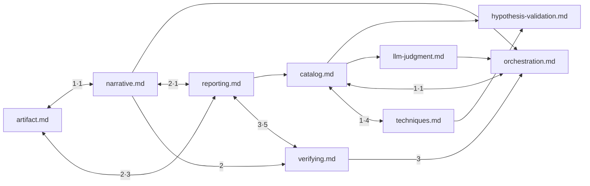

# 문서 참조 그래프

문서 9개가 서로 가리키는 관계다. 선 14개.
숫자는 언급 횟수이고, 양쪽에 화살촉이 있으면 서로 가리킨다는 뜻이다.
클릭해서 열려면 같은 폴더의 `구조.canvas` 를 쓴다.

`SKILL.md` 의 참조는 그래프에서 뺐다. 목차라서 전부 가리키는 게 정의라,
그리면 화면만 덮고 알려주는 것이 없다. 아래 표에 따로 적었다.

**이 파일은 `_map/build.py` 가 만든다. 직접 고치지 않는다.**
원본을 고쳤으면 `python _map/build.py` 로 다시 만든다.
`python _map/build.py --check` 는 어긋났을 때 종료코드 1 을 낸다.

## 참조가 몰리는 곳

| 문서 | 들어오는 참조 | 나가는 참조 |
|---|---:|---:|
| `reporting.md` | 9 | 8 |
| `catalog.md` | 6 | 4 |
| `orchestration.md` | 6 | 1 |
| `verifying.md` | 5 | 8 |
| `artifact.md` | 4 | 3 |
| `hypothesis-validation.md` | 2 | 0 |
| `narrative.md` | 2 | 6 |
| `llm-judgment.md` | 1 | 1 |
| `techniques.md` | 1 | 5 |

## 엣지

| 가리키는 쪽 | 가리켜지는 쪽 | 횟수 |
|---|---|---:|
| `verifying.md` | `reporting.md` | 5 |
| `techniques.md` | `catalog.md` | 4 |
| `reporting.md` | `artifact.md` | 3 |
| `reporting.md` | `verifying.md` | 3 |
| `verifying.md` | `orchestration.md` | 3 |
| `artifact.md` | `reporting.md` | 2 |
| `narrative.md` | `reporting.md` | 2 |
| `narrative.md` | `verifying.md` | 2 |
| `artifact.md` | `narrative.md` | 1 |
| `catalog.md` | `hypothesis-validation.md` | 1 |
| `catalog.md` | `llm-judgment.md` | 1 |
| `catalog.md` | `orchestration.md` | 1 |
| `catalog.md` | `techniques.md` | 1 |
| `llm-judgment.md` | `orchestration.md` | 1 |
| `narrative.md` | `artifact.md` | 1 |
| `narrative.md` | `orchestration.md` | 1 |
| `orchestration.md` | `catalog.md` | 1 |
| `reporting.md` | `catalog.md` | 1 |
| `reporting.md` | `narrative.md` | 1 |
| `techniques.md` | `hypothesis-validation.md` | 1 |

## `SKILL.md` 가 가리키는 것

| 가리켜지는 쪽 | 횟수 |
|---|---:|
| `catalog.md` | 3 |
| `narrative.md` | 3 |
| `orchestration.md` | 3 |
| `verifying.md` | 3 |
| `techniques.md` | 2 |
| `artifact.md` | 1 |
| `hypothesis-validation.md` | 1 |
| `llm-judgment.md` | 1 |
| `reporting.md` | 1 |

## 파일

- [[SKILL]] `SKILL.md`
- [[artifact]] `references/artifact.md`
- [[catalog]] `references/catalog.md`
- [[hypothesis-validation]] `references/hypothesis-validation.md`
- [[llm-judgment]] `references/llm-judgment.md`
- [[narrative]] `references/narrative.md`
- [[orchestration]] `references/orchestration.md`
- [[reporting]] `references/reporting.md`
- [[techniques]] `references/techniques.md`
- [[verifying]] `references/verifying.md`
